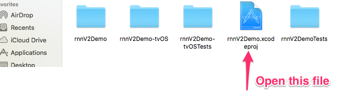
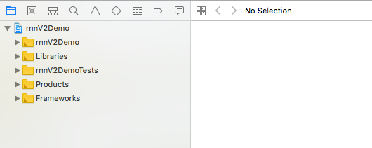
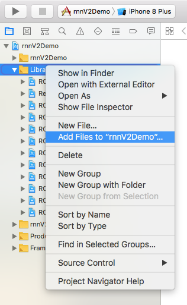
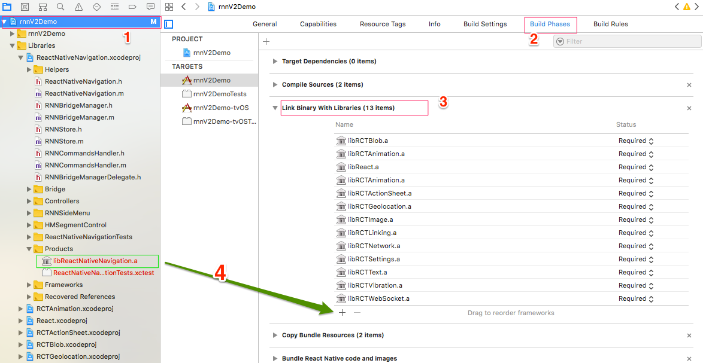
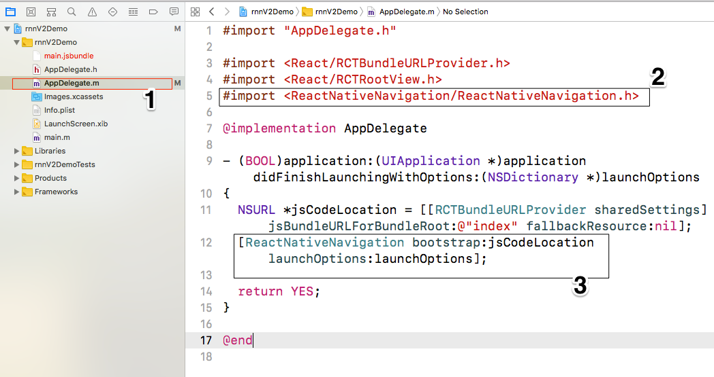

<html>
  <h2>Installing on iOS</h2>
  
Step 1:Go to ios folder in your root project and open rnnV2Demo.xcodeproj.It will open your project in Xcode

   
  
Step 2:You project folder something looks like this

  
  
Step3:In Xcode, in Project Navigator (left pane), right-click on the Libraries > Add files to [project name]

  
  
Step4:In Xcode, in Project Navigator (left pane), click on your project (top), then click on your target row (on the "project and targets list", which is on the left column of the right pane) and select the Build Phases tab (right pane). In the Link Binary With Libraries section add libReactNativeNavigation.a

  
  
Step 5:In Xcode, you will need to edit this file: AppDelegate.m

    
</html>
